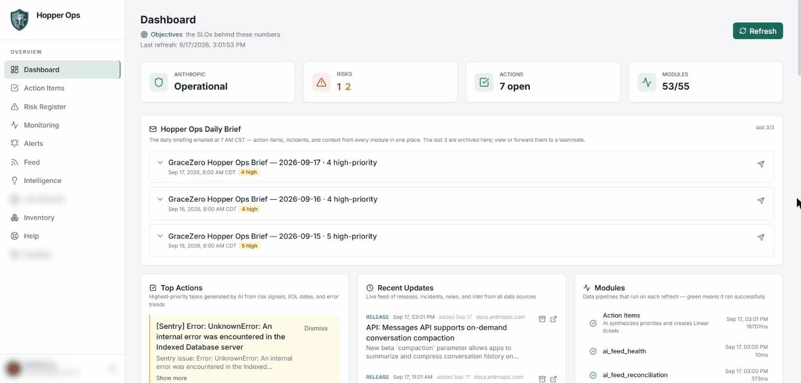
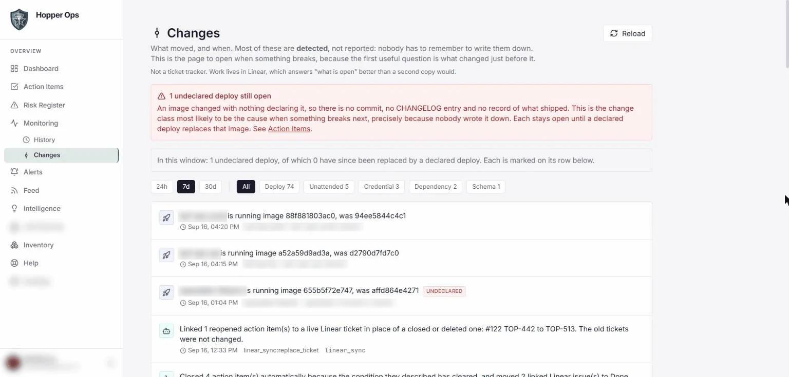
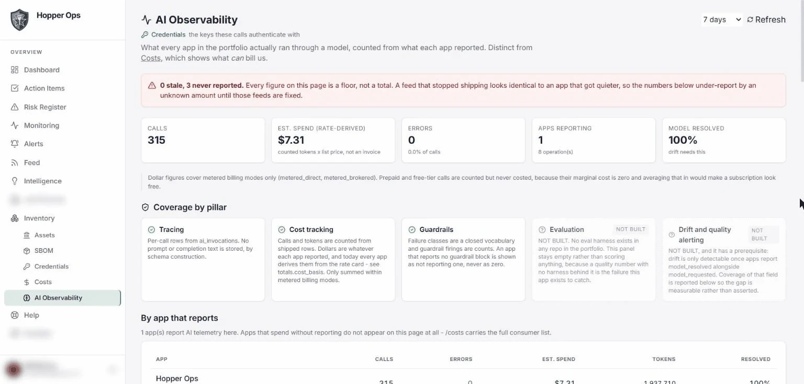
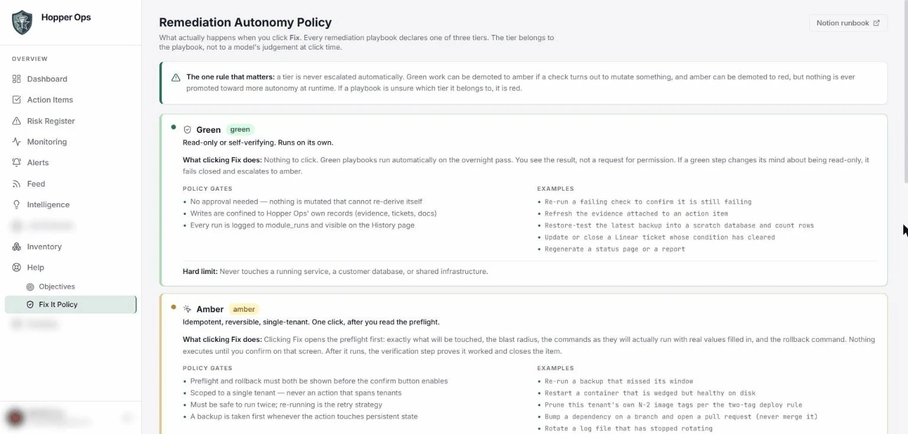
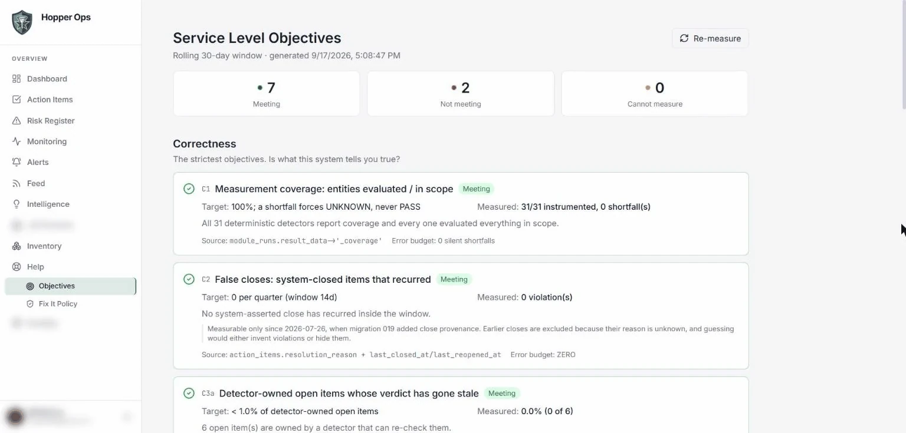

# Hopper Ops

Hopper Ops is the service management platform for everything GraceZero runs. Every production service (a Scouting trek-preparation SaaS, a youth football operations app, a space-industry content site, the company website, and Hopper Ops itself) lands here: it is monitored, its changes are detected, its risks are scored, its software inventory and credentials are tracked, its AI usage is measured, and its objectives are published with error budgets. The daily brief and the alert channel come out of the same database.

Built and operated by one engineer at GraceZero, with Claude Code as the primary development tool. Live at [hopperops.gracezero.ai](https://hopperops.gracezero.ai) (single-operator sign-in).

Every statement below was checked against the private source on 2026-09-22. This repository holds documentation and screenshots only; the source code is private.

---

## What it does today

| Capability | Mechanism |
|---|---|
| Monitoring and event management | External uptime probes, error tracking, container stats, host health logs and the vendor status page are collected on a fixed schedule; every run is recorded; conditions become action items with source keys; alerts go to a push channel with re-alert suppression; a daily brief is emailed and archived |
| Service level objectives | Nine objectives with stated targets and error budgets, measured every run and stored as daily snapshots; a check that cannot measure reports "unknown", never "pass" |
| Change detection | Deploys, schema migrations, dependency changes, credential rotations and unattended actions are observed from the environment, not from what anyone reported; a deploy nobody declared becomes an action item |
| Risk register, SBOM, end-of-life, credentials | Components with versions and end-of-life dates, snapshotted and diffed; risk scored red, yellow or green; a credential inventory that holds names, fingerprints and verification status and has no column for a value |
| Model retirements | The vendor's deprecation list is matched against model identifiers found pinned in the code of every project, so a retirement raises work only where it applies |
| AI observability | Per-call records of model, tokens, cost with provenance, latency, failure class and guardrail counts; no prompt or completion text is stored, by schema and by validator |
| Remediation runbooks | Six playbooks with a fixed autonomy tier each; every playbook declares preflight, policy gates, commands with real values, blast radius, rollback and verification; only the read-only tier can execute |
| Intelligence Lab | A separate pipeline that collects market signals and summarizes them; described at the end |

---

## How we operate: IT service management

GraceZero runs its projects with service management practices scaled to one engineer, and this platform is where those practices are enforced by code rather than by memory. The work is aligned with ITIL service management ideas, with the SRE (site reliability engineering) practice of objectives with error budgets, and with OWASP application security guidance, and it follows practices from the NIST Cybersecurity Framework and ISO/IEC 27001 where the alignment table below says so. No certification is claimed.

### Four systems, four jobs

| System | Holds | Lifespan |
|---|---|---|
| Notion | Knowledge: how things work, why decisions were made, runbooks | Long-lived |
| Linear | Work: what to do, its status and its owner | Transient; issues close |
| GitHub | Code context: CLAUDE.md, the changelog, memory files, RFC documents, code | Tied to the codebase |
| Hopper Ops | Live operational state | Live |

### Change management

- A change is anything that can affect a service: code, configuration, deploys, packages, permissions, firewall, DNS, cron and schema. Documentation and ticket creation are pre-approved standard changes. Everything else is a normal change with a written RFC (Request for Change) and a person in the loop. An emergency change is acted on first and documented in the same session.
- RFC the capability once, not every invocation: a new deploy verb gets an RFC, and a deploy that calls an approved verb is audited. Fourteen RFC documents live in the private repository's docs folder.
- Every deploy is declared to the platform with its commit and change class. A deploy the platform detects with no declaration beside it becomes an "undeclared deploy" work item, so the change record does not depend on anyone remembering to write it.
- Every code change carries its changelog entry in the same commit. A pre-commit hook blocks a commit when the in-repo memory files and the assistant-managed copies disagree.

### Incident and problem management

- Alerting has a written bar: critical means broken now and actionable now. Four conditions page the phone (a tenant reporting red, a container down, disk at or above 90 percent, the external probe failing). Everything else waits for the morning brief, and a known-bad condition does not re-alert inside its window.
- Conditions become action items keyed by their source, linked to Linear tickets, and closed by the detector that raised them once the condition clears, with the reason recorded. A false-close detector reports any system close that recurred.
- Root causes that changed the design are written up as RFC documents in the repository: scheduled module silence, root cron ownership, undeclared deploy supersession and shared credential blast radius are four of them.

### Release and deployment

- CI runs the test suite and a type check on every push and pull request. It never deploys.
- Deploys are an operator-run procedure: archive the working tree, sync it to the host, rebuild the image, verify, then declare the deploy to the platform.
- A verify-state script runs at the start of every session and fails on drift between the documented counts, the host and the deploy manifest.

### Framework alignment

| Framework | What is actually done |
|---|---|
| ITIL | Incident, problem, change and release records with provenance: action items with source keys and close reasons, RFC documents, declared deploys, and an audit table of every unattended action |
| SRE | Nine objectives with error budgets, measured every run and reported as unknown whenever they cannot be measured |
| OWASP | Security headers including a content security policy, CSRF protection, rate limits, typed input models with validators, secrets held only in environment variables |
| NIST Cybersecurity Framework | Identify: risk register, software inventory, credential inventory. Protect: one admin identity, read-only container access to the host, security headers. Detect: monitoring, change detection, alerts. Respond: tiered playbooks and action items. Recover: nightly backups, with a backup-freshness playbook that produces the change package when they fall behind |
| ISO/IEC 27001 | Practices followed in access control (one admin identity, bounded session lifetime), audit trails (every module run and every unattended action is recorded) and asset inventory (components and credentials) |

---

## Stack

| Layer | Technology |
|---|---|
| Backend | FastAPI on Python 3.12, asyncpg, pydantic models with field validators |
| Frontend | React 18, TypeScript (strict), Vite, Tailwind CSS |
| Database | PostgreSQL 16, 42 tables (counted across the base schema and migrations on 2026-09-22), 41 numbered migrations applied inside a single transaction with a pre-flight guard |
| Scheduling | 55 modules in four registries: 32 deterministic detectors, 5 editorial language-model modules, 16 intelligence collectors, 2 intelligence analyzers. Detectors and editorial modules run every 4 hours; free collectors and analyzers daily; paid collectors weekly. The schedule table is derived from the registries, and a test asserts that every module has exactly one cadence |
| Auth | Google OAuth restricted to one admin identity; server-side sessions with a 7-day lifetime; CSRF double-submit cookie; per-IP sliding-window rate limits (20 per 15 minutes on auth, 10 per minute on refresh, 100 per minute elsewhere) |
| Security headers | Strict-Transport-Security, X-Content-Type-Options and a Content-Security-Policy with its own violation-report endpoint |
| Container access | The Docker socket is reachable only through a read-only proxy (containers list, inspect and stats; no POST, exec, images or networks); host log files are mounted read-only |
| Error tracking | Sentry on the server with 20 percent trace sampling |
| Tests | 65 pytest files with 989 test cases (counted from the source on 2026-09-22), one Playwright smoke spec against the live site, plus two dependency-free check scripts for the client's navigation and table logic |
| CI | GitHub Actions on every push to the main branch and on pull requests: pytest for the backend and a TypeScript type check for the client. Documentation-only pushes skip CI, tag pushes do not re-run it, and superseded runs are cancelled |
| Deployment | Docker image behind Traefik on a hardened multi-tenant host. Deploys are an operator-run procedure (archive the working tree, sync it to the host, rebuild the image); CI never deploys. The procedure ends by declaring the deploy to the platform, so the change register can tell a declared deploy from an unexplained one |

Counts marked as counted were generated from the private source during the audit that produced this README. Counts that change often are rounded.

---

## Monitoring and event management

**Sources.** Uptime ratios and response samples from an external probe service, persisted every run so the availability objective has history to burn budget against. Unresolved issues from Sentry, filtered by environment at query time and with per-issue dismissals that never touch Sentry itself. Container status, restart counts, memory and CPU through the read-only socket proxy. Each tenant's host monitor log and the shared disk-cleanup log, parsed read-only and folded into the brief. The AI vendor's status page and incident list.

**Events.** Every module run writes a row with its result, its duration and its coverage (how many entities it evaluated out of how many were in scope). Conditions a detector finds are upserted as action items keyed by a source key, so the same condition never mints a second item and a condition that clears is closed by the detector that raised it, with the resolution reason recorded. A false-close detector re-checks system closes and reports any that recurred. A schedule-health detector reports any module that missed its own cadence. A coverage-health detector turns a coverage shortfall into work instead of a footnote.

**Alerts.** A rules module decides what is worth waking someone for. The bar is written in the code: critical means broken now and actionable now; everything else waits for the brief. Conditions are keyed and a known-bad condition stays quiet for a configured window, so a disk at 91 percent does not fire four times a day until the channel gets muted. Alerts are published to an ntfy topic with 72-hour retention, and the Alerts page shows the same 72 hours so the phone and the page agree.

**Work tracking.** Action items link to Linear tickets. A sync module compares the register with Linear every refresh, reports every disagreement in the brief, and makes exactly two kinds of write: it creates a replacement ticket when work reopened behind a ticket that was already closed, and it closes a model-written item when a person closed its ticket. It fails closed: if any read fails, nothing is written and the coverage reads as not checked.

**Daily brief.** A brief is generated and emailed at a fixed time, and archived (the newest three are kept). Delivery is measured from a send log, and that measurement is one of the objectives below.

---

## Service level objectives with error budgets

Nine objectives in four groups, each with a target and a measurement source, and an error budget where one applies:

| Group | Objective | Target and budget |
|---|---|---|
| Correctness | C1 Measurement coverage: entities evaluated over entities in scope, across every deterministic detector | 100 percent; budget of zero silent shortfalls; any shortfall forces UNKNOWN |
| Correctness | C2 False closes: items the system closed that recurred | Zero; measurable only since close provenance was added, and earlier closes are excluded rather than guessed |
| Correctness | C3a Detector-owned open items whose verdict has gone stale | Under 1 percent of detector-owned open items |
| Correctness | C3b Open items no detector can ever verify | Published as a count with no budget, never averaged into C3a |
| Freshness | F1 Daily brief generated and delivered | 93.3 percent of days, measured from the send log; budget of two misses per month |
| Freshness | F2 Scheduled modules with a successful run within twice their declared interval | 99 percent, with the budget expressed as stale module-days per month |
| Reachability | R1 A critical condition reaches a channel the operator reads within 15 minutes | 99 percent, proven by a daily canary rather than assumed |
| Availability | A1 External probe returns 200 | 99.5 percent over a rolling 30 days |
| Availability | A2 Probe response time | Average under 800 milliseconds |

**Fail closed.** The page reports each objective as meeting, not meeting or cannot measure (pass, fail and unknown in the code). The code comment at the top of the objectives module states the rule: an objective that cannot be measured right now reports unknown and is never treated as passing. A coverage shortfall on C1 forces unknown rather than a pass with a footnote. C2 reports unknown for the period before its measurement existed rather than zero violations.

**Enforced at the source.** A test parses the abstract syntax tree of every core detector and fails if any return path omits the coverage pair, because the dangerous edit is a new early return in an existing detector, not a new module. The one exemption is listed in the test with its reason. Measurements are stored as daily snapshots so the page can show a trend instead of only the current reading.

---

## Change detection that does not rely on self-reporting

The change detector is built around the words "documented or not". A change log that only holds what people remembered to write misses the change most likely to have caused the outage, because the person who skipped the process also skipped the record.

Five sources, all already available without new credentials or a looser socket proxy:

- **Deploys:** the container's image identifier and start time, read through the read-only proxy
- **Schema:** the migration ledger rows written by the migration script
- **Dependencies:** version changes in the component inventory
- **Credentials:** a change in a credential's fingerprint (a rotation, never the value)
- **Unattended actions:** the audit table that green-tier automation writes to

Timestamps are the change's own (a container's start time), not the poll's, so a change found three hours later lands where it happened. Declaration is a separate, additive path: the deploy procedure posts a declaration with the commit and the change class. A detected deploy with no declaration beside it becomes an "undeclared deploy" action item that retires by itself once a later deploy of a different image is both detected and declared. The page also lists what this method cannot see (environment file edits, host cron, host packages, firewall and proxy configuration), so a half-covered surface does not read as full coverage.

---

## Risk register, SBOM, end-of-life tracking and credential inventory

**SBOM (software bill of materials).** A components table holds infrastructure, runtimes, services, SDKs, security tooling and pinned AI model identifiers, each with current version, target version, end-of-life date, days remaining, risk reasoning, owning project and last-verified date. A snapshot is taken every run and compared with the previous snapshot, so additions, removals and version changes are reported as a diff. Runtime versions are collected daily from inside every container rather than copied from a list.

**End-of-life.** Components are checked against endoflife.date. Thresholds were retuned from a year to 90 and 180 days because, with annual release cadences, a one-year yellow bar kept the register permanently noisy. The workflow automation platform gets a live version check (read from the running container's image tag) and a CVE (Common Vulnerabilities and Exposures) check against the OSV database for that measured version.

**Risk register.** A scorer turns end-of-life countdowns into red (critical), yellow (warning) and green (healthy) risk items with status tracking and history. The register schema also carries security, deprecation and drift categories.

**Credential inventory.** The table has columns for key name, scope, location, provider, category, an 8-character fingerprint of the value's hash, blast radius, status, when the status was last established and by what method. There is no column for a value; the module handles fingerprints and names only. Status is live, failed or unverifiable. A key is proven live by use where a detector exercises it every run, by an explicit probe where nothing else exercises it (SMTP, which is how a dead mail password once hid for two weeks), or by matching a DSN's public key against the provider's key list. A key the platform cannot test is reported unverifiable, never live.

**Cost inventory.** Per-application running cost with a billing mode and a provenance for every number (measured from counts, or estimated from a rate card). A pooled-billing finding fires only when the credential inventory shows one key shared by several applications.

---

## Model retirements matched against model identifiers pinned in code

The deprecation module parses the AI vendor's official deprecations page with a tolerant table-row pattern; if parsing fails it falls back to an embedded snapshot and raises an action item saying the page drifted. It emits work only for models that a separate scanner found pinned somewhere in the estate. The scanner walks every project checkout on the workstation and, in its host mode, every deployment on the server; it records each pinned identifier with its project, and writes a scan-history row so the detector can tell "the scan ran and found nothing" from "the scan never ran". Aliases of live models are not flagged because they auto-update. The two places that normalize a model identifier (the scanner and the detector) must agree, and a test pins that agreement against the vendor SDK's deprecation table after one day when they silently disagreed and matched nothing.

---

## AI observability

Hopper Ops' own model calls, and one website's, are recorded in one table with: provider, the model that was requested and the model that actually answered, prompt identifier and prompt hash, trace identifier, input, output and cached token counts, cost in dollars with a provenance (rate card, provider reported, or unknown; an unknown cost is null, never zero), latency, status, a closed vocabulary of failure classes enforced by database constraints, and a JSON object of guardrail counts. Billing modes are kept apart so a prepaid call's zero marginal cost is never averaged into metered spend. Bringing the other applications' model calls into the same table is in progress.

**Prompts and completions are not stored.** The migration has no column that could hold one, the ingest model has no field that could carry one, and the guardrails validator rejects any value that is not a number or boolean. A test reads the migration, the schema and the route source and fails if a content-bearing column or field appears.

**Tracing.** Operations are declared in a registry with a tier derived from four risk axes (metered spend, silent wrongness, data exposure, unreviewed action). One other application ships batches over HTTP with an ingest token that cannot trigger a refresh or run a playbook; Hopper Ops instruments its own calls in-process. A registry column records when each operation last reported, and a structural test asserts that every code path that inserts an invocation also updates the registry, after a case where one path did not and a page showed "11 operations never reported" when the true number was 3.

**Honesty on the page.** Figures are shown as floors, not totals: a feed that stopped shipping looks identical to an application that got quieter, so the page says how many operations are stale or never reported. Evaluation and drift panels are labelled "not built" rather than left empty.

---

## Remediation runbooks with fixed autonomy tiers

Six playbooks exist: two green (re-check a detector's condition; check a TLS certificate's expiry) and four red (backup staleness; container not running; Docker disk growth; version, end-of-life or CVE drift).

- **Tier is a class attribute.** Green (read-only or self-verifying), amber (idempotent, reversible, single-tenant) or red (destructive or shared infrastructure). It is fixed at definition time and validated when the class is defined; it is never a model's judgement at click time, and a tier can be demoted at runtime but never promoted.
- **Five required parts.** Preflight (what will be touched and the blast radius, computed fresh on every request), policy gates, commands rendered with real values, the exact rollback, and the verification that proves it worked. A playbook that cannot state all five does not load.
- **Only green executes.** The run endpoint rejects amber and red with a 403, and the playbook base class rejects them again independently. Red playbooks produce a change package for a person to run. Amber is currently unreachable by architecture: this container cannot mutate the host (read-only socket proxy, read-only mounts, no shell), and that hardening is deliberate.
- **Verify and close.** A separate endpoint re-measures an item through its playbook's preflight and closes it only if the condition has cleared. It never calls execute, so it is safe on a red playbook. The client can ask, never assert; a still-broken item gets a 409 with the fresh measurement.
- **Audit.** Every unattended action that changed something (retention deletes, feed purge, brief-archive pruning, auto-resolve, duplicate collapse) writes an audit row, and those rows are also one of the change detector's five sources.

The policy that governs this is published inside the application as the Remediation Autonomy Policy page.

---

## Where language models are used, stated plainly

Models in use: Claude Haiku 4.5 for the five editorial modules (two release-note summaries, a news digest, notable finds, and action-item synthesis) and the duplicate judge; Claude Sonnet 5 for the intelligence trend detector; Claude Opus 5 for the intelligence opportunity brief. Two on-demand features (draft a reply to a public post; discover voices to follow) also call a model.

What model output is: text for the brief and the feed, suggestion records, trend and opportunity records, and proposed groupings of duplicate action items.

**No language model triggers or executes an action.** No model call exists in the playbook code, the run endpoint, the verify-close endpoint, the Linear sync or the change detector. Playbooks run only on a human click and only at the green tier. Since August 2026 the synthesis module writes suggestions, not action items; the code states that nothing in it can create a work order, and a person promotes a suggestion or it stays inert. That change followed a measurement: 78 percent of the model-written items ever minted had been dismissed, and several were false.

The one place model output changes state is the duplicate judge. It receives a fixed list of open items and returns groupings; unknown identifiers are dropped, a group covering more than half the input is rejected, and any error returns no groups. Deterministic code then drops model-written candidates that duplicate an existing item before insert, and retires model-written items into the detector-owned item they duplicate, keeping the text and a pointer to the survivor. Detector-owned items are never changed by a model verdict, and Linear tickets for retired items are left for a person.

---

## Intelligence Lab

A separate pipeline on the same platform. Sixteen collectors gather signals from discussion sites, developer question boards, feeds, code hosting, vendor blogs and news, video channels, local business listings, two social-network collectors and other market sources. Four collectors use paid sources and run weekly. Signals are classified deterministically into pain points and capability signals. A trend detector (Sonnet 5) clusters each stream; scoring is a deterministic momentum and noise formula, with a trend promoted when momentum is at least 60 and noise at most 50, and persistence tracked by a normalized title key so a trend seen again accumulates evidence instead of starting over. An opportunity brief (Opus 5) synthesizes across streams and must fill a "why this might not work" field and pass a written disqualification list before an opportunity is stored. A voices registry controls whose posts are collected. Output lands in the suggestions and opportunities pages; nothing here executes anything.

---

## Built with Claude Code

This platform was built with Claude Code as the primary development tool, directed by one engineer. The private repository carries the working agreements that make that reliable:

- A project context file (CLAUDE.md) that inherits universal standards from a global file and states the session-start protocol, the deploy rules and the things that break easily
- A verify-state script run at the start of every session that compares documented counts against the code, the host and the deploy manifest, and fails on drift
- A pre-commit hook that blocks a commit when the in-repo memory files differ from the assistant-managed copies
- A changelog entry in the same commit as every code change, and an RFC (Request for Change) document in the repository for every change that touches a live service (14 such documents in the docs folder on 2026-09-22)
- Co-authorship trailers on the large majority of commits, so the record of what was built with the assistant is in the history rather than in a claim

---

## Screenshots

Captured from the live instance. The operator identity, some navigation entries and container names are covered.

### Dashboard

### Changes

### AI Observability

### Remediation Autonomy Policy

### Service Level Objectives

---

## This repository

Documentation and screenshots only. The source code is maintained privately.

## License

MIT for the documentation in this repository.
